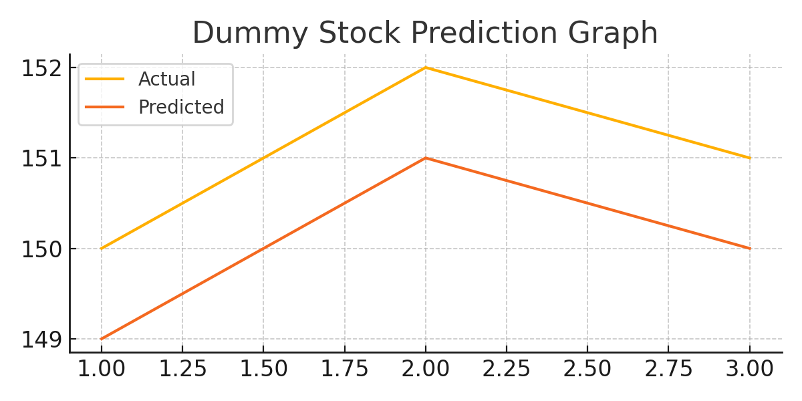

# 📈 Stock Price Prediction using LSTM Neural Networks

## 🧠 Problem Statement
Predicting stock market trends is crucial for smarter financial decisions. This project uses a Long Short-Term Memory (LSTM) neural network to forecast stock prices using historical data.

---

## 🎯 Objective
Build an LSTM-based deep learning model to predict stock prices from Yahoo Finance data and visualize the predicted trends versus actual stock prices.

---

## 📁 Dataset
- **Source**: Yahoo Finance via `yfinance` API  
- **Ticker Used**: AAPL (Apple Inc.)  
- **Field Used**: `Close` prices from 2020–2023  

---

## 📦 Requirements

```bash
pip install pandas numpy matplotlib yfinance scikit-learn tensorflow
```

---

## 🚀 How to Run

1. Clone/download the repository  
2. Run the Python script:

```bash
python stock_price_lstm.py
```

3. Output graph `stock_prediction.png` will be generated.

---

## 📊 Output Screenshot

> The graph below shows how the model tracks historical trends:



---

## 👩‍💻 Author
**Aswathi C D**  
Submitted as part of academic project requirements.

---

## 📬 Contact  
📧 aswathidileep2024@gmail.com